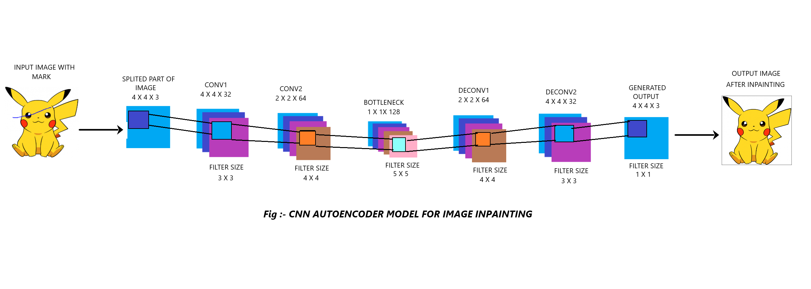

# Single_Image_Inpainting

In this project we have used some deep learning model to remove the damaged portion from the image by putting appropriate pixels for the damaged portion to retrieve the original image. We have applied deep learning models like Autoencoder to learn and produce the original image from the given scratched image.

## Method

Our image inpainting approach makes a clear difference between damaged and undamaged areas. Damaged areas are marked as such in a mask. The information in these areas is reconstructed using information from the remainder, i.e. the undamaged, areas.

Steps involved in the image inpainting task is as per follows,

   •  Read the image and its respective mask.
  
   •	Both image and mask is subjected to zero padding so that every corners of the image can be trained properly.
  
   •	Divide the image into many small slices (4x4 in our case), and partition them into two sets i.e. training and testing sets. Training set includes only slices of image           which don’t have any damages within them.
  
   •  Add noise to the training dataset. The noise is added to the image, prior to being fed into a sequence of convolutional layers. This ensures that the AE does not disregard       the noise.
  
   •	Build the model, set up the layers (encoder, bottleneck and decoder). Compile the model to add Loss function (ex: - mse in our task), Optimizer (ex: - Adam), Metrics (ex:       accuracy).
  
   •  Feed the training data to train the model. The model learns the image slices. Save the weights of trained model.
  
   •  Now the model is ready to make the prediction. Feed the test dataset (damaged image slices) to the model to generate new samples. Paste these samples in the appropriate         locations in the input image to get image without mark.
  
## Model Description
  
Here we are using a convolutional neural network (CNN) architecture to prepare a model (Convolutional AE) which we will use to inpaint an image (remove mark from the image).
Like other AE our model also contains 3 sections i.e. encoder, bottleneck and decoder. Both encoder and decoder contains two CNN blocks and bottleneck contains only a single Conv2D layer.

   1.  In Encoder section we have added two Conv2D layers with 32, 64 channels and (3,3), (4,4) kernel and same padding. The encoder part also contains MaxPooling2D layers and          it is subjected to Batch Normalization and Dropout with drop rate of 0.25. We are gradually increasing the number of channels and size of kernels. This will be helpful          for the network to understand what information it should learn.
   
   2.  The bottle neck contains a Conv2D layer with 128 channel and kernel size of (5,5). It is the reduced encoded representation or Latent Representation of input data.
   
   3.  In Decoder section we have added two Conv2D layers with 64, 32 channels and (4,4), (3,3) kernel and same padding. The decoder part also contains UpSampling2D layers and          it is subjected to Batch Normalization and Dropout with drop rate of 0.25. Intuitively, the decoder recovers the WHERE information (precise localization) by gradually            applying up sampling.
   

## Installing

  1. Make sure you have these installed
	  - [jupyter notebook](https://jupyter.org/)
	  - [git](http://git-scm.com/)
  2. Install all the packages needed by running the following command in your environment. 
    `
    python -m pip install -r requirements.txt
    `
  3. Clone this repository into your local machine using the Gitbash `> git clone CLONEURL`
